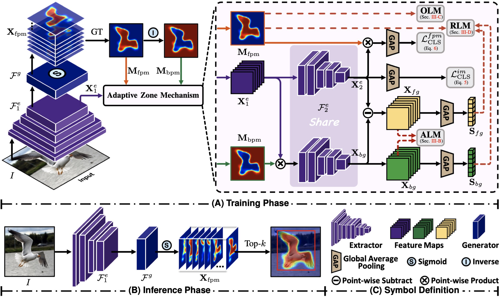

# Adaptive Zone Learning for Weakly Supervised Object Localization (TNNLS 2024)

PyTorch implementation of ''Adaptive Zone Learning for Weakly Supervised Object Localization''. 


## 📋 Table of content
 1. [📎 Paper Link](#1)
 2. [💡 Abstract](#2)
 3. [📖 Method](#3)
 4. [📃 Requirements](#4)
 5. [✏️ Usage](#5)
    1. [Start](#51)
    2. [Prepare Datasets](#52)
    3. [Training](#53)
    4. [Inference](#54)
 <!-- 6. [🔍 Citation](#6) -->

## 📎 Paper Link <a name="1"></a> 

* Adaptive Zone Learning for Weakly Supervised Object Localization ([link]())

    Authors: Zhiwei Chen, Siwei Wang, Liujuan Cao, Yunhang Shen, Rongrong Ji
    
    Institution: Xiamen University, Xiamen, China. Tencent Youtu Lab, Shanghai, China.


## 💡 Abstract <a name="2"></a> 
Weakly supervised object localization (WSOL) stands as a pivotal endeavor within the realm of computer vision, entailing the location of objects utilizing merely imagelevel labels. Contemporary approaches in WSOL have leveraged foreground prediction maps (FPMs), yielding commendable outcomes. However, these existing FPM-based techniques are predominantly confined to rudimentary strategies of either augmenting the foreground or diminishing the background presence. We argue for exploration and exploitation of the intricate interplay between the object’s foreground and its background to achieve efficient object localization. In this manuscript, we introduce an innovative framework, termed as Adaptive Zone Learning (AZL), which operates on a coarse-to-fine basis to refine FPMs through a triad of adaptive zone mechanisms. First, an adversarial learning mechanism (ALM) is employed, orchestrating an interplay between the foreground and background regions. This mechanism accentuates coarse-grained object regions in a mutually adversarial manner. Subsequently, an oriented learning mechanism (OLM) is unveiled, which harnesses local insights from both foreground and background in a fine-grained manner. This mechanism is instrumental in delineating object regions with greater granularity, thereby generating better foreground prediction maps. Furthermore, we propose a reinforcement learning mechanism (RLM) as the compensatory mechanism for adversarial design, by which the undesirable foreground maps are refined again. Extensive experiments on CUB-200-2011 and ILSVRC datasets demonstrate that AZL achieves significant and consistent performance improvements over other state-of-the-art WSOL methods.

## 📖 Method <a name="3"></a> 

<p align="center">
     <br />
    <em> 
    </em>
</p>
The architecture of the proposed Adaptive Zone Learning Network.

## 📃 Requirements <a name="4"></a> 
  - python 3.7.13
  - torch 1.7.0
  - torchvision 0.8.1

## ✏️ Usage <a name="5"></a> 

### Start <a name="51"></a> 

```bash  
git clone git@github.com:zhiweichen0012/AZL.git
cd AZL
```

### Prepare Datasets <a name="52"></a> 

* CUB ([http://www.vision.caltech.edu/visipedia/CUB-200-2011.html](http://www.vision.caltech.edu/visipedia/CUB-200-2011.html))
* ILSVRC ([https://www.image-net.org/challenges/LSVRC/](https://www.image-net.org/challenges/LSVRC/))


### Training <a name="53"></a> 

To train AZL on CUB with VGG backbone run:

```bash
bash scripts/train.sh 0 vgg 69 0.6 1.2 0.8 1 6
```

NOTE: Please check the paths to the "python3" command, the dataset, and the pre-training weights.

### Inference <a name="54"></a> 

To test the CUB models, you can run:

```bash  
bash scripts/test.sh 0 vgg logs/vgg/model_to_path
```

NOTE: Please check the paths to the "python3" command and the dataset.

<!-- ## 🔍 Citation <a name="6"></a> 

```
@inproceedings{chen2024,
  title={Adaptive Zone Learning for Weakly Supervised Object Localization},
  author={Chen, Zhiwei and Wang, Siwei and Cao, Liujuan and Shen, Yunhang and Ji, Rongrong},
  year={2024}
}
``` -->
